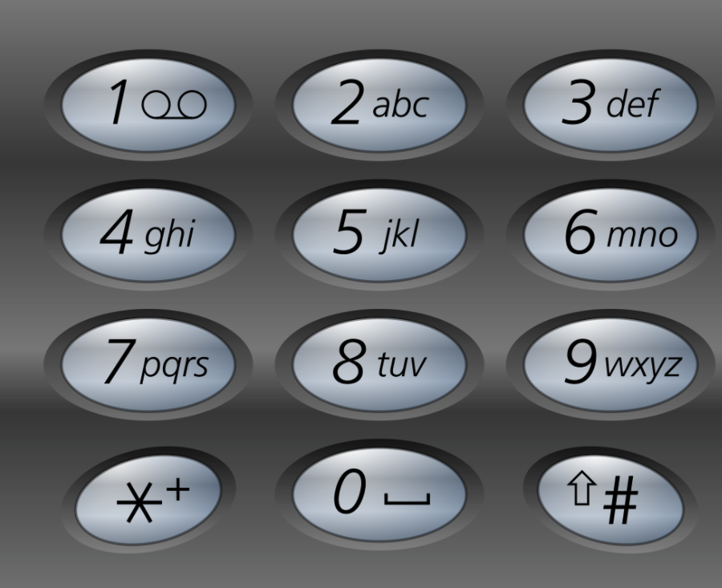

# Word Suggestions from Keypad

Given a string containing digits from 2-9 inclusive, return all possible valid English words that the number could represent. Return the answer in alphabetical order. 

You are given a list of 10000 English words in the file [english_words.txt](./english_words.txt) which you can use to check if any word is a valid word or not.

A mapping of digit to letters (just like on the telephone buttons) is given below. Note that 1 does not map to any letters.



### Examples
```
Input: digits = "23"
Output: []
```

```
Input: digits = "6463"
Output: [ 'mime', 'mind', 'mine', 'nine' ]
```

```
Input: digits = "43556"
Output: [ 'hello' ]
```
